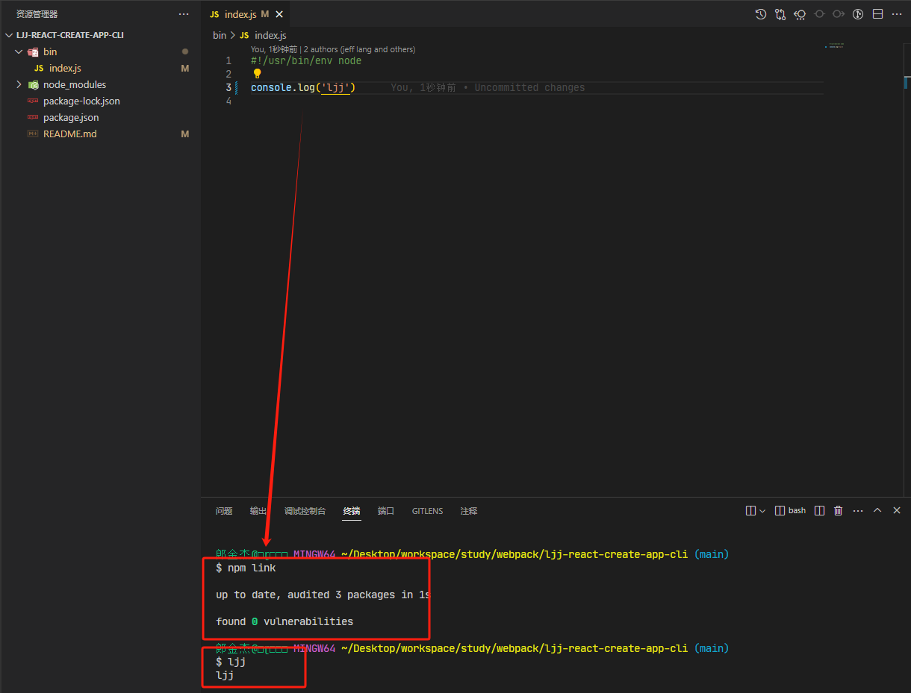
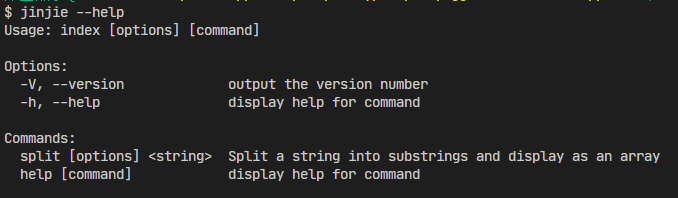

# 脚手架

## 0、前言

脚手架的只要目的是：

1. **统一开发规范**：不同的开发者可能 有不同的编码风格和开发习惯，这会导致代码风格不一致，难以维护。而使用
2. **模板和工具集成**：大公司通常有自己的项目和业务需求，可以根据自己的业务场景和需求定制化一套适用的脚手架模板和工具集成，能够大大减少开发过程的重复劳动和人为出错的可能性
3. **提高开发效率**：自己定制的脚手架可以提供一些常用的功能和组件，如路由，状态管理，UI组件库等，这些都可以减少开发者的编码时间和提高开发效率
4. **保证代码质量**：适用自己定制的脚手架可以通过内置的代码检测工具等来保证代码质量，减少出现BUG的可能性。

定制化开发自己的脚手架可以帮助公司实现前端开发的标准化，规范化，自动化，提高开发效率和代码质量，降低维护成本

## 1、项目初始化

```shell
npm init -y
```

会生成一个`package.json`文件

```json
{
  "name": "ljy-create-react-app",
  "version": "1.0.0",
  "description": "",
  "main": "index.js",
  "scripts": {
    "test": "echo \"Error: no test specified\" && exit 1"
  },
  "keywords": [],
  "author": "",
  "license": "ISC"
}

```

## 2、配置入口文件

在`package.json`同层级下创建一个`bin`文件夹，并在里面创建`node`入口文件`index.js`，编辑`index.js`文件：

```javascript
#!/usr/bin/env node
console.log('ljj')
```

第一行代码`#!/usr/bin/env node`是一个`node.js`脚本的开头，它指定了脚本应该使用的解释器，即在环境变量`$PATH`中查找`"node"`可执行文件。此行告诉操作系统这个文件应该使用`node`作为解释器来执行。该脚本可以在类Unix系统（例如Linux、macOS等）中直接运行。

例如，如果你有一个名为`index.js`的`Node.js`脚本，包含这个行，那么你可以在终端输入以下命令来运行它：

```shell
$ ./index.js
```

如果没有这行，操作系统系统无法识别他是一个`node.js`脚本，可能会尝试使用默认解释器来执行，例如Bash。这样可能导致错误，因为Bash不理解`Node.js`代码

然后再`package.json`中添加`bin`字段

```json
{
  "name": "ljj-create-react-app",
  "version": "1.0.0",
  "description": "",
  "main": "index.js",
  "bin": {
    "ljj": "bin/index.js"
  },
  "scripts": {
    "test": "echo \"Error: no test specified\" && exit 1"
  },
  "keywords": [],
  "author": "",
  "license": "ISC",
  "dependencies": {
    "commander": "^11.1.0"
  }
}

```

## 3、npm link ——链接到全局

在文件目录下运行`npm link`将项目链接到本地，就可以临时实现`demo`指令全局调用。（`--force`参数可以强制覆盖原有指令）

```shell
npm link
```



```javascript
const { program } = require("commander");

// const program = new Command();

program.version(require("../package.json").version); // 获取版本号
/**
 *  第一个参数 --first 这是一个布尔选项，不需要值。
 * -s, --separator <char>：此选项允许您指定用作分隔符的字符。
 */
// program.option("--first").option("-s, --separator <char>");

program
  .command("split") // 定义了一个名为 "split" 的子命令。
  .description("Split a string into substrings and display as an array") // 为 "split" 子命令添加描述。
  .argument("<string>", "string to split") // 定义了一个名为 <string> 的参数，表示要拆分的字符串。
  .option("-f, --first", "display just the first substring") // --first 是一个布尔值
  .option("-s, --separator <char>", "separator character", ",") // 定义了一个 -s 或 --separator 选项，它允许用户指定分隔符字符，如果用户未提供分隔符，则默认为逗号 (,)
  .action((str, options) => {
    console.log('options', options);
    const limit = options.first ? 1 : undefined;
    console.log(str.split(options.separator, limit));
  });


program.parse(); // 调用program.parse()方法，以根据定义的选项解析命令行参数。

/* const options = program.opts();
const limit = options.first ? 1 : undefined;


console.log("args", program.args);
console.log(program.args[0]?.split(options.separator, limit)); */
```

然后执行`ljj`，发现命令行被执行了！并打印出了我们在入口文件中输出的代码。

## 4、commander——指令系统

### 4.1 基本指令

比如我们会通过不同的命令去做不同的事情：

- `ljj --version`
- `ljj--help`
- `ljj --create xx`
- ...

通常会使用一个第三方库：很多脚手架都是基于这个库来配置指令的，那我们先安装：

```shell
npm install commander
```

使用：

```shell
#!/usr/bin/env node

const program = require("commander");

program.version(require("../package.json").version);

// 解析用户执行时输入的参数，process.argv 是 nodejs 提供的属性
// 比如：npm run server --port 3000，后面的 --port 3000 就是用户输入的参数
program.parse(process.argv);
```

`commander`自身附带了`--help`指令，导入成功后，在命令执行`jinjie --help`，可以打印基本的帮助提示。然后我们就可以使用如下的指令了：



就是这么简单！

为简化使用，commander提供了一个全局对象。本文档的示例代码均按照此方法使用：

- `CommonJS (.cjs)`

```javascript
// CommonJS (.cjs)
const { program } = require('commander');

```

- `ECMAScript (.mjs)`

这种兼容性不好，最后使用`cjs`

```javasc
/**
 * 使用es方法必须在package中配置 "type": "module"
 */
import { program } from 'commander'
import packageJson from '../package.json' assert { type: 'json' }
```

- `Typescript(.ts)`

```typescript
// TypeScript (.ts)
import { Command } from 'commander';
const program = new Command();
```

下面来看第一个例子

```javascript
#!/usr/bin/env node

const { program } = require("commander");

program.option("--first").option("-s, --separator <char>");

program.parse();

const options = program.opts();
const limit = options.first ? 1 : undefined;

console.log("args", program.args);
console.log(program.args[0].split(options.separator, limit));
```

```shell
% jinjie -s / --first a/b/c
args [ 'a/b/c' ]
[ 'a' ]

```

这是一个使用子命令并带有帮助描述的更完整的程序。在多命令程序中，每个命令（或命令的独立可执行文件）都有一个操作处理程序

再来看一个

```javascript
#!/usr/bin/env node

/**
 * 使用es方法必须在package中配置 "type": "module"
 */
// import { program } from 'commander'
// import packageJson from '../package.json' assert { type: 'json' }

const { program } = require('commander')

// const program = new Command();

// program.version(packageJson.version) // 获取版本号
program.version(require('../package.json').version) // 获取版本号
/**
 *  第一个参数 --first 这是一个布尔选项，不需要值。
 * -s, --separator <char>：此选项允许您指定用作分隔符的字符。
 */
// program.option("--first").option("-s, --separator <char>");

program
  .command('split') // 定义了一个名为 "split" 的子命令。
  .description('Split a string into substrings and display as an array') // 为 "split" 子命令添加描述。
  .argument('<string>', 'string to split') // 定义了一个名为 <string> 的参数，表示要拆分的字符串。
  .option('-f, --first', 'display just the first substring') // --first 是一个布尔值
  .option('-s, --separator <char>', 'separator character', ',') // 定义了一个 -s 或 --separator 选项，它允许用户指定分隔符字符，如果用户未提供分隔符，则默认为逗号 (,)
  .action((str, options) => {
    console.log('options', options)
    const limit = options.first ? 1 : undefined
    console.log(str.split(options.separator, limit))
  })

program.parse() // 调用program.parse()方法，以根据定义的选项解析命令行参数。

/* const options = program.opts();
const limit = options.first ? 1 : undefined;


console.log("args", program.args);
console.log(program.args[0]?.split(options.separator, limit)); */

```

然后执行下面的命令：

```shell
# 注意！在windows中//代表一个/ 如果只输入一个/代码的是当前git的绝对路径
$ jinjie split a/b/c -f -s //
options { separator: '/', first: true }
[ 'a' ]
```

### 4.2 命令行参数options

Commander使用`.options()`方法来定义选项，同时可以附加选项的简介。每个选项可以定义一个短选项名称（`-`后面接单个字符）和一个长选项名称（`--`后面借一个或多个单词），使用逗号、空格或者`|`分隔。

解析后的选项可以通过`command`对象上的`.opts()`方法获取，同时会被传递给命令处理函数。

对于多个单词的长选项，选项名会转换为驼峰命名法（camel-case），例如`--template-engine`选项可通过`program.opts().templateEngine`获取

- `-`：简写
- `--`：全称
- `<xxx>`：代表必填参数（后面不跟参数会提示少参数）

选项及其选项参数可以用空格分隔，也可以组合成同一个参数。选项参数可以直接跟在短选项之后，也可以在长选项后面加上`=`。

```javascript
serve -p 80
serve -p80
serve --port 80
serve --port=80
```

> `--`可以标记选项的结束，后续的参数均不会被命令解释

默认情况下，选项在命令行中的顺序不固定，一个选项可以在其他参数之前或之后指定。

当`.opts()`不够用时，还有其他相关方法：

- `.optsWithGlobals()`返回合并的本地和全局选项值

- `.getOptionValue()`和`.setOptionValue()`操作单个选项的值

- `.getOptionValueSource()`和`.setOptionValueWithSource()`包括选项值的来源

#### 4.2.1 常用选项类型，boolean型选项和带参数选项

有两种最常用的选项，一类是`boolean`型选项，选项无需配置参数，另一类选项则可以设置参数（使用尖括号声明在该选项后，如`--expect <value>`）。如果在命令中不指定具体的选项及参数，则会被定义为`undefined`。

```javascript
program
  .option('-d, --debug', 'output extra debugging')
  .option('-s, --small', 'small pizza size')
  .option('-p, --pizza-type <type>', 'flavour of pizza');

program.parse(process.argv);

const options = program.opts();
if (options.debug) console.log(options);
console.log('pizza details:');
if (options.small) console.log('- small pizza size');
if (options.pizzaType) console.log(`- ${options.pizzaType}`);

```

多个布尔短选项可以在破折号之后组合在一起，并且可以跟一个取值的单一选项。 例如 `-d -s -p cheese` 可以写成 `-ds -p cheese` 甚至 `-dsp cheese`。

```shell
$ jinjie -dsp type
{ debug: true, small: true, pizzaType: 'type' }
pizza details:
- small pizza size
- type
```

> 具有预期选项参数的选项的贪婪的，并且无论值如何，都会消耗参数。所以`--id -xyz`读取`-xyz`作为选项参数

通过`program.parse(arguments)`方法处理参数，没有被使用的选项会存放在`program.args`数组中。该方法的参数是可选的，默认值为`process.argv`。
