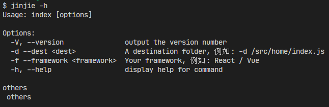

# 脚手架

## 0、前言

脚手架的只要目的是：

1. **统一开发规范**：不同的开发者可能 有不同的编码风格和开发习惯，这会导致代码风格不一致，难以维护。而使用
2. **模板和工具集成**：大公司通常有自己的项目和业务需求，可以根据自己的业务场景和需求定制化一套适用的脚手架模板和工具集成，能够大大减少开发过程的重复劳动和人为出错的可能性
3. **提高开发效率**：自己定制的脚手架可以提供一些常用的功能和组件，如路由，状态管理，UI组件库等，这些都可以减少开发者的编码时间和提高开发效率
4. **保证代码质量**：适用自己定制的脚手架可以通过内置的代码检测工具等来保证代码质量，减少出现BUG的可能性。

定制化开发自己的脚手架可以帮助公司实现前端开发的标准化，规范化，自动化，提高开发效率和代码质量，降低维护成本

## 1、项目初始化

```shell
npm init -y
```

会生成一个`package.json`文件

```json
{
  "name": "ljy-create-react-app",
  "version": "1.0.0",
  "description": "",
  "main": "index.js",
  "scripts": {
    "test": "echo \"Error: no test specified\" && exit 1"
  },
  "keywords": [],
  "author": "",
  "license": "ISC"
}

```

## 2、配置入口文件

在`package.json`同层级下创建一个`bin`文件夹，并在里面创建`node`入口文件`index.js`，编辑`index.js`文件：

```javascript
#!/usr/bin/env node
console.log('ljj')
```

第一行代码`#!/usr/bin/env node`是一个`node.js`脚本的开头，它指定了脚本应该使用的解释器，即在环境变量`$PATH`中查找`"node"`可执行文件。此行告诉操作系统这个文件应该使用`node`作为解释器来执行。该脚本可以在类Unix系统（例如Linux、macOS等）中直接运行。

例如，如果你有一个名为`index.js`的`Node.js`脚本，包含这个行，那么你可以在终端输入以下命令来运行它：

```shell
$ ./index.js
```

如果没有这行，操作系统系统无法识别他是一个`node.js`脚本，可能会尝试使用默认解释器来执行，例如Bash。这样可能导致错误，因为Bash不理解`Node.js`代码

然后再`package.json`中添加`bin`字段

```json
{
  "name": "ljj-create-react-app",
  "version": "1.0.0",
  "description": "",
  "main": "index.js",
  "bin": {
    "ljj": "bin/index.js"
  },
  "scripts": {
    "test": "echo \"Error: no test specified\" && exit 1"
  },
  "keywords": [],
  "author": "",
  "license": "ISC",
  "dependencies": {
    "commander": "^11.1.0"
  }
}

```

## 3、npm link ——链接到全局

在文件目录下运行`npm link`将项目链接到本地，就可以临时实现`demo`指令全局调用。（`--force`参数可以强制覆盖原有指令）

```shell
npm link
```


```javascript
const { program } = require("commander");

// const program = new Command();

program.version(require("../package.json").version); // 获取版本号
/**
 *  第一个参数 --first 这是一个布尔选项，不需要值。
 * -s, --separator <char>：此选项允许您指定用作分隔符的字符。
 */
// program.option("--first").option("-s, --separator <char>");

program
  .command("split") // 定义了一个名为 "split" 的子命令。
  .description("Split a string into substrings and display as an array") // 为 "split" 子命令添加描述。
  .argument("<string>", "string to split") // 定义了一个名为 <string> 的参数，表示要拆分的字符串。
  .option("-f, --first", "display just the first substring") // --first 是一个布尔值
  .option("-s, --separator <char>", "separator character", ",") // 定义了一个 -s 或 --separator 选项，它允许用户指定分隔符字符，如果用户未提供分隔符，则默认为逗号 (,)
  .action((str, options) => {
  console.log('options', options);
  const limit = options.first ? 1 : undefined;
  console.log(str.split(options.separator, limit));
});


program.parse(); // 调用program.parse()方法，以根据定义的选项解析命令行参数。

/* const options = program.opts();
const limit = options.first ? 1 : undefined;


console.log("args", program.args);
console.log(program.args[0]?.split(options.separator, limit)); */
```

然后执行`ljj`，发现命令行被执行了！并打印出了我们在入口文件中输出的代码。

## 4、commander——指令系统

### 4.1 基本指令

比如我们会通过不同的命令去做不同的事情：

- `ljj --version`
- `ljj--help`
- `ljj --create xx`
- ...

通常会使用一个第三方库：很多脚手架都是基于这个库来配置指令的，那我们先安装：

```shell
npm install commander
```

使用：

```shell
#!/usr/bin/env node

const program = require("commander");

program.version(require("../package.json").version);

// 解析用户执行时输入的参数，process.argv 是 nodejs 提供的属性
// 比如：npm run server --port 3000，后面的 --port 3000 就是用户输入的参数
program.parse(process.argv);
```

`commander`自身附带了`--help`指令，导入成功后，在命令执行`jinjie --help`，可以打印基本的帮助提示。然后我们就可以使用如下的指令了：


就是这么简单！

为简化使用，commander提供了一个全局对象。本文档的示例代码均按照此方法使用：

- `CommonJS (.cjs)`

```javascript
// CommonJS (.cjs)
const { program } = require('commander');

```

- `ECMAScript (.mjs)`

这种兼容性不好，最后使用`cjs`

```javasc
/**
* 使用es方法必须在package中配置 "type": "module"
*/
import { program } from 'commander'
import packageJson from '../package.json' assert { type: 'json' }
```

- `Typescript(.ts)`

```typescript
// TypeScript (.ts)
import { Command } from 'commander';
const program = new Command();
```

下面来看第一个例子

```javascript
#!/usr/bin/env node

const { program } = require("commander");

program.option("--first").option("-s, --separator <char>");

program.parse();

const options = program.opts();
const limit = options.first ? 1 : undefined;

console.log("args", program.args);
console.log(program.args[0].split(options.separator, limit));
```

```shell
% jinjie -s / --first a/b/c
args [ 'a/b/c' ]
[ 'a' ]

```

这是一个使用子命令并带有帮助描述的更完整的程序。在多命令程序中，每个命令（或命令的独立可执行文件）都有一个操作处理程序

再来看一个

```javascript
#!/usr/bin/env node

/**
 * 使用es方法必须在package中配置 "type": "module"
 */
// import { program } from 'commander'
// import packageJson from '../package.json' assert { type: 'json' }

const { program } = require('commander')

// const program = new Command();

// program.version(packageJson.version) // 获取版本号
program.version(require('../package.json').version) // 获取版本号
/**
 *  第一个参数 --first 这是一个布尔选项，不需要值。
 * -s, --separator <char>：此选项允许您指定用作分隔符的字符。
 */
// program.option("--first").option("-s, --separator <char>");

program
  .command('split') // 定义了一个名为 "split" 的子命令。
  .description('Split a string into substrings and display as an array') // 为 "split" 子命令添加描述。
  .argument('<string>', 'string to split') // 定义了一个名为 <string> 的参数，表示要拆分的字符串。
  .option('-f, --first', 'display just the first substring') // --first 是一个布尔值
  .option('-s, --separator <char>', 'separator character', ',') // 定义了一个 -s 或 --separator 选项，它允许用户指定分隔符字符，如果用户未提供分隔符，则默认为逗号 (,)
  .action((str, options) => {
  console.log('options', options)
  const limit = options.first ? 1 : undefined
  console.log(str.split(options.separator, limit))
})

program.parse() // 调用program.parse()方法，以根据定义的选项解析命令行参数。

/* const options = program.opts();
const limit = options.first ? 1 : undefined;


console.log("args", program.args);
console.log(program.args[0]?.split(options.separator, limit)); */

```

然后执行下面的命令：

```shell
# 注意！在windows中//代表一个/ 如果只输入一个/代码的是当前git的绝对路径
$ jinjie split a/b/c -f -s //
options { separator: '/', first: true }
[ 'a' ]
```

### 4.2 命令行参数options

Commander使用`.options()`方法来定义选项，同时可以附加选项的简介。每个选项可以定义一个短选项名称（`-`后面接单个字符）和一个长选项名称（`--`后面借一个或多个单词），使用逗号、空格或者`|`分隔。

解析后的选项可以通过`command`对象上的`.opts()`方法获取，同时会被传递给命令处理函数。

对于多个单词的长选项，选项名会转换为驼峰命名法（camel-case），例如`--template-engine`选项可通过`program.opts().templateEngine`获取

- `-`：简写
- `--`：全称
- `<xxx>`：代表必填参数（后面不跟参数会提示少参数）

选项及其选项参数可以用空格分隔，也可以组合成同一个参数。选项参数可以直接跟在短选项之后，也可以在长选项后面加上`=`。

```javascript
serve -p 80
serve -p80
serve --port 80
serve --port=80
```

> `--`可以标记选项的结束，后续的参数均不会被命令解释

默认情况下，选项在命令行中的顺序不固定，一个选项可以在其他参数之前或之后指定。

当`.opts()`不够用时，还有其他相关方法：

- `.optsWithGlobals()`返回合并的本地和全局选项值

- `.getOptionValue()`和`.setOptionValue()`操作单个选项的值

- `.getOptionValueSource()`和`.setOptionValueWithSource()`包括选项值的来源

#### 4.2.1 常用选项类型，boolean型选项和带参数选项

有两种最常用的选项，一类是`boolean`型选项，选项无需配置参数，另一类选项则可以设置参数（使用尖括号声明在该选项后，如`--expect <value>`）。如果在命令中不指定具体的选项及参数，则会被定义为`undefined`。

```javascript
program
  .option('-d, --debug', 'output extra debugging')
  .option('-s, --small', 'small pizza size')
  .option('-p, --pizza-type <type>', 'flavour of pizza');

program.parse(process.argv);

const options = program.opts();
if (options.debug) console.log(options);
console.log('pizza details:');
if (options.small) console.log('- small pizza size');
if (options.pizzaType) console.log(`- ${options.pizzaType}`);

```

多个布尔短选项可以在破折号之后组合在一起，并且可以跟一个取值的单一选项。 例如 `-d -s -p cheese` 可以写成 `-ds -p cheese` 甚至 `-dsp cheese`。

```shell
$ jinjie -dsp type
{ debug: true, small: true, pizzaType: 'type' }
pizza details:
- small pizza size
- type
```

> 具有预期选项参数的选项的贪婪的，并且无论值如何，都会消耗参数。所以`--id -xyz`读取`-xyz`作为选项参数

通过`program.parse(arguments)`方法处理参数，没有被使用的选项会存放在`program.args`数组中。该方法的参数是可选的，默认值为`process.argv`。

#### 4.2.2 选项的默认值

选项可以设置一个默认值。

```javascript
#!/usr/bin/env node

const { Command } = require("commander");
const program = new Command();

// 可选参数
program.option('-c, --cheese <type>', 'add the specified type of cheese', 'blue')

// program.parse(process.argv)
program.parse()
const options = program.opts()

console.log(`cheese: ${options.cheese}`)
```

```shell
$ jinjie
cheese: red
```

> 注：选项默认值，必须在该选项不输入的情况下生效，不能只输入选项，不输入选项值的情况

#### 4.2.3 必填选项

通过`.requireOption()`方法可以设置选项为必填。必填选项要么设置有默认值，要么必须在命令行中输入，对应的属性字段在解析时必定会有赋值。该方法其余参数与`.option()`一致。

```javascript
#!/usr/bin/env node

const { Command } = require("commander");
const program = new Command();

program.requiredOption("-c, --cheese <type>", "pizza must have cheese");

program.parse();
```

```shell
$ jinjie
error: required option '-c, --cheese <type>' not specified
```

详细的信息可以看[官方文档 - 中文](https://link.juejin.cn/?target=https%3A%2F%2Fgithub.com%2Ftj%2Fcommander.js%2Fblob%2Fmaster%2FReadme_zh-CN.md)。

### 4.3 监听指令

```shell
#!/usr/bin/env node

// ...

// 监听指令
program.on("--help", function () {
  console.log(""); // 一般打一行空行，便于阅读
  console.log("others");
});

program.parse(process.argv);

// ...
```

### 4.4 归档指令

一般我们会将这些指令单独放在一个地方去归档，以便于以后维护，比如再根目录中新建一个lib来专门放这些指令的信息，将`help`指令的信息放在——`lib/core/help.js`：

```javascript
const program = require('commander')

const helpOptions = () => {
  // 增加自己的options
  program.option('-d --dest <dest>', 'A destination folder, 例如: -d /src/home/index.js')
  program.option('-f --framework <framework>', 'Your framework, 例如: React / Vue')

  // 监听指令
  program.on('--help', function () {
    console.log('')
    console.log('others')
    console.log(' others')
  })
}

module.exports = helpOptions

```

`index.js`：

```javascript
#!/urs/bin/env node
const program = require('commander')

// 查看版本号
program.version(require('../package.json').version)

const helpOptions = require('../lib/core/help')

// 帮助和可选信息
helpOptions()

program.parse(process.argv)

```

测试：



### 4.5 配置指令

通过`.command()`或`.addCommand()`可以配置命令，有两种实现方式：为命令绑定处理函数，或者将命令单独写成一个可执行文件（详述见后文）。子命令支持嵌套。

`.command()`的第一个参数为命令名称。命令参数可以跟在名称后面，也可以用`.argument()`单独指定。参数可为必选的（尖括号表示`<xxx>`）、可选的（方括号表示`[xxx]`）或变长参数（点号便是，如果使用，只能是最后一个参数）。

使用`.addCommand()`向`program`增加配置好的子命令

```javascript
// 通过绑定处理函数实现命令（这里的指令描述为放在`.command`中）
// 返回新生成的命令（即该子命令）以供继续配置
program
  .command('clone <source> [destination]')
  .description('clone a repository into a newly created directory')
  .action((source, destination) => {
    console.log('clone command called');
  });

// 通过独立的的可执行文件实现命令 (注意这里指令描述是作为`.command`的第二个参数)
// 返回最顶层的命令以供继续添加子命令
program
  .command('start <service>', 'start named service')
  .command('stop [service]', 'stop named service, or all if no name supplied');

// 分别装配命令
// 返回最顶层的命令以供继续添加子命令
program
  .addCommand(build.makeBuildCommand());

```

使用`.command()`和`addCommand()`来指定选项的相关设置。当设置`hidden: true`时，该命令不会打印在帮助信息里。当设置`isDefault: true`时，若没有指定其他子命令，则会默认执行这个命令。

### 4.6 指令参数

如上所述，子命令的参数可以通过`.commad()`来指定。对于有独立可执行文件的子命令来说，参数只能这种方法指定。而其他子命令，参数也可以用以下方法。

在`Command`对象上使用`argument()`来按次序指定命令参数（测试也 可以直接通过`program的aegument()`）。该方法接受参数名称和参数描述。参数可为必选的（尖括号表示，例如`<required>`）或可选的（方括号表示，例如`[optional]`）。

```javascript
#!/urs/bin/env node
const program = require('commander')

// 查看版本号
program.version(require('../package.json').version)

const helpOptions = require('../lib/core/help')

// 帮助和可选信息
helpOptions()

program
  .version('0.1.0')
  .argument('<username>', 'user to login')
  .argument('[password]', 'password for user, if required', 'no password given')
  .action((username, password) => {
  console.log('username:', username)
  console.log('password:', password)
})

program.parse(process.argv)

```

测试：

```shell
$ ljj jeff 123456
username: jeff
password: 123456
```

在参数名后加上`...`来声明可变参数，且只有最后一个参数支持这种用法。可变参数会以数组的形式传递给处理函数。例如：

```javascript
program
  .version('0.1.0')
  .command('rmdir')
  .argument('<dirs...>')
  .action(function (dirs) {
  dirs.forEach((dir) => {
    console.log('rmdir %s', dir);
  });
});

```

有一种便捷方式可以一次性指定多个参数，但不包含参数描述

```javascript
program
  .version('0.1.0')
  .command('rmdir')
  .arguments('<username> <password>')
  .argument('<dirs...>')
  .action(function (a, b, c) {
  console.log('dirs:', a, b, c)
})
```

#### 4.6.1 其他参数配置

有少数附加功能可以直接构造`Argument`对象，对参数进行更加详尽的配置

```javascript
program
  .addArgument(new commander.Argument('<drink-size>', 'drink cup size').choices(['small', 'medium', 'large']))
  .addArgument(new commander.Argument('[timeout]', 'timeout in seconds').default(60, 'one minute'))
```

在这段代码中：

- `<drink-size>` 是一个必需的参数，它接受三个选项：‘small’，‘medium’，‘large’。
- `[timeout]` 是一个可选参数，其默认值为60秒。如果未提供，将设置为 ‘one minute’。

请记住将 `'small'`，`'medium'`，`'large'` 和 `60` 替换为你的实际值。另外，不要忘记在最后调用 `program.parse(process.argv);` 来解析命令行参数。

#### 4.6.2 自定义参数处理

选项的参数可以通过自定义函数来处理（与处理选项参数时类似），该函数接收两个参数：用户新输入的参数值和当前已有的参数值（即上一次调用自定义处理函数后的返回值），返回新的命令参数值。

处理后的参数值会传递给命令处理函数，同时可通过`process.argv(.processedArgs)`获取。可以在自定义函数的后面设置命令参数的默认值或初始值。

```javascript
program
  .command('add')
  .argument('<first>', 'integer argument', myParseInt)
  .argument('[second]', 'integer argument', myParseInt, 1000)
  .action((first, second) => {
  console.log(`${first} + ${second} = ${first + second}`);
})
;

```

### 4.7 处理函数

命令处理函数的参数，为该命令声明的所有参数，除此之外还会附加两个额外参数：一个是解析出的选项，另一个则是该命令对象自身。

```js
program
  .argument('<name>')
  .option('-t, --title <honorific>', 'title to use before name')
  .option('-d, --debug', 'display some debugging')
  .action((name, options, command) => {
    if (options.debug) {
      console.error('Called %s with options %o', command.name(), options);
    }
    const title = options.title ? `${options.title} ` : '';
    console.log(`Thank-you ${title}${name}`);
  });
```

测试：

```shell
ljy-create-react-app % ljy --title=hello kevin -d
Called ljy with options { title: 'hello', debug: true }
Thank-you hello kevin
```

如果你愿意，你可以跳过为处理函数声明参数直接使用 command。 `this` 关键字设置为运行命令，可以在函数表达式中使用（但不能从箭头函数中使用）。

```js
program
  .command('serve')
  .argument('<script>')
  .option('-p, --port <number>', 'port number', 80)
  .action(function() {
  console.error('Run script %s on port %s', this.args[0], this.opts().port);
});
```

处理函数支持`async`，相应的，需要使用`.parseAsync`代替`.parse`。

```js
async function run() { /* 在这里编写代码 */ }

async function main() {
  program
    .command('run')
    .action(run);
  await program.parseAsync(process.argv);
}
```

使用命令时，所给的选项和命令参数会被验证是否有效。凡是有未知的选项，或缺少所需的命令参数，都会报错。 如要允许使用未知的选项，可以调用`.allowUnknownOption()`。默认情况下，传入过多的参数并不报错，但也可以通过调用`.allowExcessArguments(false)`来启用过多参数的报错。

### 4.8 生命周期钩子

可以在命令的生命周期事件上设置回调函数

```javascript
// 生命周期钩子
program
  .command('hello <name>')
  .option('-t, --trace', 'display trace statements for commands')
  .description('Say hello to someone')
  .hook('preAction', (thisCommand, actionCommand) => {
  console.log(`Hello`, thisCommand.args)
  console.log(`About to call action handler for subcommand: ${actionCommand.name()}`)
  console.log('arguments: %O', actionCommand.args)
  console.log('options: %o', actionCommand.opts())
})
  .action(name => {
  console.log(`Hello, ${name}!`)
})
```

钩子函数支持`async`，相应的，需要使用`.parseAsync`代替`.parse`。一个事件上可以添加多个钩子。

支持的事件有：

| 事件名称                  | 触发时机                            | 参数列表                       |
| ------------------------- | ----------------------------------- | ------------------------------ |
| `preAction`, `postAction` | 本命令或其子命令的处理函数执行前/后 | `(thisCommand, actionCommand)` |
| `preSubcommand`           | 在其直接子命令解析之前调用          | `(thisCommand, subcommand)`    |

## 5、设计 create action

一般我们会将这些指令单独放在一个地方去归档，以便于以后维护，比如在根目录中新建一个`lib`专门来放这些指令的信息，将`help`指令的信息放在`lib/core/help.js`，创建指令的信息放在`lib/core/create.js`

### 5.1 helpOptions

下面实现`helpOptions`:

```javascript
// lib/core/help.js

const program = require('commander');

const helpOptions = () => {

  // 增加自己的options
  program.option('-d --dest <dest>', 'A destination folder，例如： -d /src/home/index.js')
  program.option('-f --framework <framework>', 'Your framework，例如： React / Vue')

  // 监听指令
  program.on('--help', function(){
    console.log('')
    console.log('Others')
    console.log(' others')
  })
}

module.exports = helpOptions;

```

在`bin/index.js`中使用：

```javascript
#! /usr/bin/env node

// bin/index.js

const program =  require('commander');

// 查看版本号
program.version(require('../package.json').version);

const helpOptions = require('../lib/core/help');

// 帮助和可选信息
helpOptions();

program.parse(process.argv);

```

### 5.2 createCommands

再实现`createCommands`

```javascript
const program = require('commander')

const createCommands = () => {
  program
    .command('create <project> [others...]')
    .description('clone a repo into a folder')
    .action((project, others) => {
      console.log('project', project)
      console.log('others', others)
    })
}

module.exports = createCommands

```

并引入到`bin/index.js`中

```javascript
#!/usr/bin/env node

const program =  require('commander');

// 查看版本号
program.version(require('./package.json').version);

const helpOptions = require('./lib/core/help');
const createCommands =  require('./lib/core/create');

// 帮助和可选信息
helpOptions();

// 创建指令
createCommands();

program.parse(process.argv);

```

测试

```shell
$ jinjie create 123 1234 1234
project 123
others [ '1234', '1234' ]
```

### 5.3 createProjectActions

`action`的回调函数就是我们脚手架的核心流程了，将其抽离到一个单独的文件`lib/core/action.js`中：

```javascript
// lib/core/actions

// 引入commands
const program = require('commander')
const createProjectAction = require('./actions')

// 定义一个函数存放create命令
const createCommands = () => {
  program
    .command('create <project> [others...]')
    .description('clone a repository into a folder')
    .description('clone a repository into a folder')
  // createProjectAction
    .action(createProjectAction)
}

// 导出这个函数
module.exports = createCommands

```

#### 5.3.1 clone项目

`clone`项目一会会用到一个工具库：[download-git-repo](https://link.juejin.cn/?target=https%3A%2F%2Fwww.npmjs.com%2Fpackage%2Fdownload-git-repo)，它是放在`npm`和`gitlab`上的，在`github`上面没有仓库，`vue-cli`用的也是这个来下载项目模板。

先下载库

```shell
npm install download-git-repo
```

这个库不好的地方就是它使用的写法比较老旧：

```javascript
download('flippidippi/download-git-repo-fixture', 'test/tem',function(err){
  console.log(err ? 'Error' : 'Success')
})
```

我们一般会将repo地址提取出来，方便以后进行维护：


```javascript
// 这里需要再后面带一个分支信息，否则会报错 仓库地址 "direct:"+仓库的地址+"#分支"
const reactRepo = 'direct:https://github.com/JeffLang/React18_TS4.x_Webpack5#main'

// 导出
module.exports = {
  reactRepo,
}

```

我们的操作都是在回调里面去做，如果当操作很多的时候，就会造成回调地狱。所幸，node提供了一个模块可以改变这种操作—— `promisify`，可以将这种方法转化成 `promise` 形式。

```javascript
// lib/core/actions.js

// 封装create指令的actions

// 使用promisify转换为promise写法
const { promisify } = require('util')
const download = promisify(require('download-git-repo'))
// 引入要下载的仓库
const { reactRepo } = require('../config/repo-config')

// 封装create指令的action
const createProjectAction = async (project, others) => {
  console.log('project', project)
  console.log('others', others)

  // 1. clone项目
  await download(reactRepo, project, { clone: true })

  // 2. 运行npm install

  // 3. 运行npm run dev
}

// 导出
module.exports = createProjectAction

```

此时就可以克隆出我的配置对应地址的仓库了

# 遇到的问题

## 1. `npm link`失效

- 问题：`npm link` 后失败，遇到`--No such file or directory`

- 解决

  ```javascript
  // 失效
  #!/urs/bin/env node
  // 修改为次重新npm link解决
  #! /usr/bin/env node
  ```

  ```javascript
  // lib/core/actions.js
  
  // 封装create指令的actions
  
  // 使用promisify转换为promise写法
  const { promisify } = require('util')
  const download = promisify(require('download-git-repo'))
  // 引入要下载的仓库
  const { reactRepo } = require('../config/repo-config')
  
  // 封装create指令的action
  const createProjectAction = async (project, others) => {
    console.log('project', project)
    console.log('others', others)
  
    // 1. clone项目
    await download(reactRepo, project, { clone: true })
  
    // 2. 运行npm install
  
    // 3. 运行npm run dev
  }
  
  // 导出
  module.exports = createProjectAction
  
  ```
  
  现在我们测试一下这个指令，新建一个测试文件夹，然后再终端运行：
  
  ```shell
  jinjie create demo-repo
  ```
  
  #### 5.3.2 执行 npm install
  
  接下来，我们希望再clone完项目代码之后，自动执行`pcakage.json`中的`dependencies`依赖的安装，并且将依赖下载的信息打印再控制台里。
  
  > 需要注意的是，我这里使用的是pnpm，如果你没有这个工具，可能会报错。

还可以使用`chalk`对控制台信息做一些美化，先安装依赖：

```shell
npm i chalk@4.0.0
```


